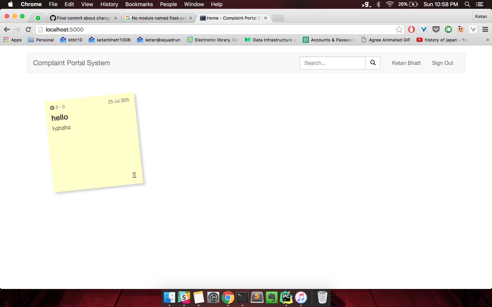

# has-complaints
https://hasjob.co/ inspired complaint portal :grin:

## Features:
1. Add post-it notes style compaints which are arranged based on a their hotness (ooh yeah)
2. Has support for admins, although for that you will have to do programmatically :grin:
3. Users can upvote each others complaints, based on which a score is calculated.
4. The score/hotness also depends on the lifetime of the complaint (Reddit/HN style)
5. Admins can mark complaints as "Under process" so people know that their complaint was heard
6. A complaint gets resolved when both the admin, and the complaining user marks the complaint resolved (Genius right?)
7. View to see all complaints you have made or upvoted
8. Search complaints

## Excuses:
1. It is an old project that I just made github ready and so it might have a few problems.
2. I  had forgotten adding a `requirements` file then, and since then changed my working machine. So had to manually add dependencies by making the code break. **The code is working**, but it might break at few places because of the missing modules, please add them to requirements and send a PR!

## Screenshots:

Sorry for the unprofessional screenshot above, I am just lazy. But you get the feel right?
